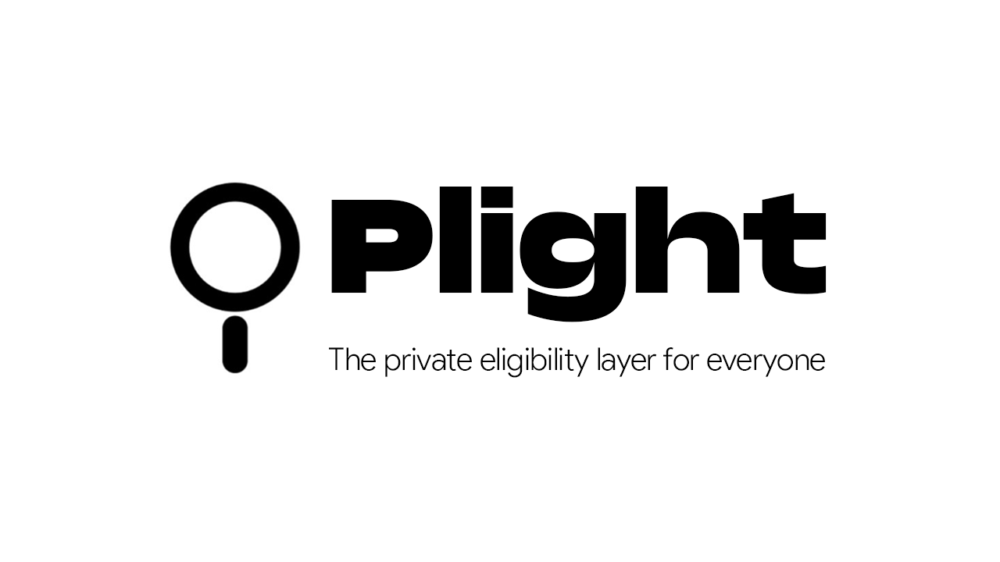
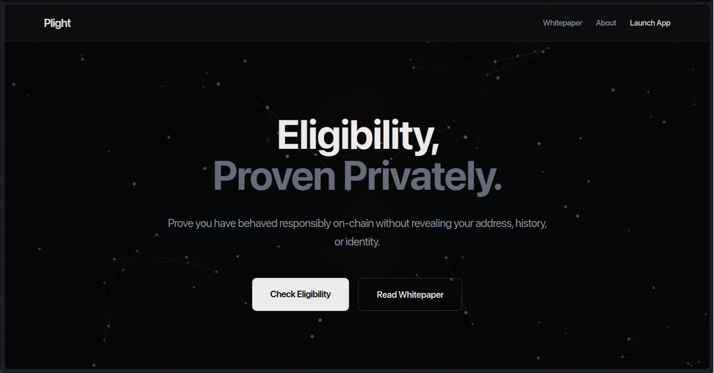
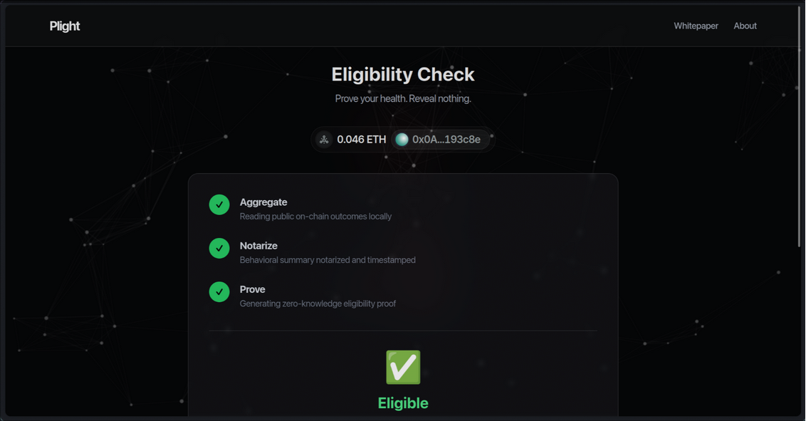

# Plight

**Privacy-Preserving DeFi Eligibility Layer**

Plight enables users to prove their on-chain reputation (e.g., "I have not been liquidated in the last year") to DeFi protocols without revealing their wallet address or transaction history. It bridges the gap between anonymous DeFi and reputation-based finance using Zero-Knowledge Proofs.

## The Problem

DeFi protocols currently treat all users the same. To protect against bad actors, they force everyone to over-collateralize and pay high premiums. Existing solutions for "credit scores" often require KYC (doxxing) or publicizing your entire wallet history, which goes against the ethos of privacy-preserving finance.

## How It Works

Plight uses a **Commit-and-Prove** architecture to separate data verification from identity revelation.

1.  **Aggregate (Off-Chain):** The user connects their wallet. The Plight Aggregation Engine scans their history across protocols (Aave, Compound) on multiple chains (Ethereum, Polygon) to compute behavioral metrics (e.g., liquidation count).
2.  **Notarize (Blind Signing):** The Aggregator sends a blinded summary to the Notary Service. The Notary signs this summary, attesting to its validity without knowing the user's identity or storing the data.
3.  **Prove (Client-Side ZK):** The user's browser generates a Zero-Knowledge Proof (using SnarkJS/Circom). This proof cryptographically asserts:
    *   "I hold a valid attestation from the Notary."
    *   "The attestation says my liquidation count is 0."
    *   "I am not revealing my address or the signature itself."
4.  **Verify (On-Chain):** The user submits the proof to a DeFi protocol's smart contract. The contract verifies the proof and grants access to better terms (e.g., lower collateral ratio) without ever learning *who* the user is.

## UI Preview

| Landing Page | Sample UI Layer for Users |
|:---:|:---:|
|  |  |

## Architecture

This project is organized as a monorepo:

*   **[`apps/web`](apps/web/README.md)**: The user-facing dashboard. Built with Next.js, Wagmi, and Tailwind. Handles wallet connection and client-side proof generation.
*   **`apps/notary`**: A trusted service that verifies off-chain data and issues EdDSA signatures on Poseidon hashes.
*   **[`apps/aggregator`](apps/aggregator/README.md)**: The engine that fetches data from multiple chains and protocols.
*   **[`packages/aggregation-engine`](packages/aggregation-engine/README.md)**: Core logic for normalizing and aggregating DeFi history.
*   **`packages/circuits`**: Circom circuits that define the logic for the Zero-Knowledge proofs.
*   **`packages/contracts`**: Solidity contracts for verifying proofs on-chain.
*   **[`packages/sdk`](packages/sdk/README.md)**: Shared TypeScript libraries for proof generation and API communication.

## Getting Started

### Prerequisites
- Node.js 18+
- pnpm or npm

### Installation

```bash
npm install
```

### Running the Stack

1.  **Start the Notary Service:**
    ```bash
    npm run dev --workspace=apps/notary
    ```

2.  **Start the Frontend:**
    ```bash
    npm run dev --workspace=apps/web
    ```

3.  **Visit:** `http://localhost:3002`

## Demo

[](https://youtu.be/Fs5uEWURC6s)

Watch the full demo here: https://youtu.be/Fs5uEWURC6s


